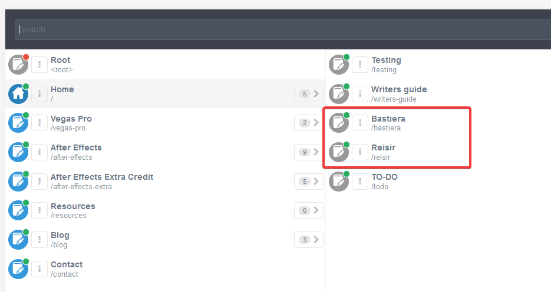

amv.tools is built with [Grav](https://getgrav.org/). It's made with [PHP](https://www.php.net/) and it runs on my server, behind an [nginx](https://www.nginx.com/) reverse proxy.

===

Grav orders pages by folder structure and it converts markdown files into HTML. Markdown is a simplified form of HTML, it allows you to write content with less "code-y" stuff in the midst of it. For example, in HTML a page heading might look like this `<h1>Hello, World!</h1>`. While in markdown it simply looks like this `# Hello, World!`. You might also be familiar with Discords (and others) text styling which also uses markdown. `*italicized*`, `**bold**`, `~~strikethrough~~` etc.

Here's a markdown guide [https://www.markdownguide.org/basic-syntax/](https://www.markdownguide.org/basic-syntax/). You only really need to know what it looks like, the admin panel editor has buttons for common stuff like headings and links and images.

### Site rules

1. Do not edit other authors profile or blog pages.
2. Images and videos should be compressed to a reasonable degree before uploading to the site.
3. No fucking swearing or NSFW content on non-personal pages! This includes your author signature, it is displayed on all pages you author!
4. [I](/reisir) see everything you do on amv.tools.
	- Use a password that you do not use on other sites, **I might be able to see that too** (grav does encrypt it but it might be possible to find the key it uses for encrypting). I recommend you use a password manager (good to do in any case).
	- All page edits trigger an automatic GitHub backup to https://github.com/reisir/tools. It is public.

### Creating new pages

To create a page, go to ["pages"](https://amv.tools/admin/pages) in the admin panel and click "Add" in the top right. Make sure the template is set to "Default".

After creating a page, the editor opens. Save the page once to create it on disk. Grav treats it as a draft before saving the first time.

The page editor has a media upload field under the main content. You can use it to upload and insert media to pages. You cannot upload media before saving the first time.

### Writing guidelines

 - Vegas Pro has been owned by MAGIX since Vegas Pro 14. Do not call it "Sony Vegas".
 - Please refrain from using meta text eg. "in this guide" or personal language eg. "now I will do x". If you see these on pages I've written, complain to me.
 - You don't have to worry too much about the language / style you use when making guides. I will go over and edit them whether you want to or not. Except blog posts.

All pages require a summary. A summary is defined with the summary delimiter `===`. The page summary should ideally summarize the pages topic. It's also used for embedding the page on other platforms etc. 

This pages summary for reference:

```md
	amv.tools is built with [Grav](https://getgrav.org/). It's made with [PHP](https://www.php.net/) and it runs on my server, behind an [nginx](https://www.nginx.com/) reverse proxy.
	
	===
```

### Writing tips

 - You can save the content without reloading the editor with [kbd="ctrl + shift + S"]
 - The page editor includes the Options and Advanced tabs.
 	- In options you can edit the Published status of a page, making it inaccessible. 
 	- In Advanced you can edit the visibility of a page, making it not show up in the menu (but still accessible by url if it's published). 
 	- You can also re-order pages in the Advanced tab (make sure the page has the Folder Numeric Prefix enabled).

### Editing your author profile

The author profile card found at the bottom of pages you've marked yourself as an author in can be edited by changing the information on your personal page. Your personal page is located under Home (/) and is named as your user name. The author information card uses the name of the page to find it and displays the title as the name on the card. 



The author profile card automatically uses the first image found in your author page. So if you want to change it, upload a new image and remove the old one.

To edit your author signature (the information card shown in the footer), edit the the [raw][section="signature"][/raw] block. All content in it is automatically inserted in the information card.

To mark yourself as an author for a page, add your username in the authors taxonomy field (found in the options tab in the non-expert editor). 


You can also use the Expert mode yaml editor. Here's an example:

    taxonomy:
        authors:
            - reisir

### Aligning content

To align content like images next to text, use the row and divider shortcodes. A row can have any number of dividers. Rows can contain any elements.

#### Example:

[row]
First column
[divider]
Second column
[divider]
Third column
[/row]

[raw]
	[row]
    	First column
    [divider]
    	Second column
    [divider]
    	Third column
    [/row]
[/raw]

### Icons

I've made a custom shortcode for application icons. Usage: [raw]`[i=untwirl]`[/raw] results in [i=untwirl] 

A table of all icons is available at the bottom of this page.

### Technicalities

* First level headings `#` are automatically centered by the site theme. So use second `##` and third `###` level headings in pages.
* Some pages have [raw]`[assets]`[/raw] blocks. These contain page specific styles and / or scripts and you should ignore all of them.
* If you see `{ .panel }` when editing pages, it's a custom style to apply a blue after effects style border to an image.

### Available [raw][i][/raw]cons

| Name                     | Icon            |
| ------------------------ | --------------- |
| 3d                       | [i=3d/]         |
| alias                    | [i=alias/]      |
| frame                    | [i=frame/]      |
| index                    | [i=index/]      |
| moblur                   | [i=moblur/]     |
| shy                      | [i=shy/]        |
| speaker                  | [i=speaker/]    |
| stopwatch                | [i=stopwatch/]  |
| untwirl                  | [i=untwirl/]    |
| adjustment               | [i=adjustment/] |
| eye                      | [i=eye/]        |
| fx                       | [i=fx/]         |
| lock                     | [i=lock/]       |
| name                     | [i=name/]       |
| solo                     | [i=solo/]       |
| star                     | [i=star/]       |
| tag                      | [i=tag/]        |
| text                     | [i=text/]       |
| vtext (vertical text)    | [i=vtext/]      |
| pen                      | [i=pen/]        |
| shape                    | [i=shape/]      |
| vpgear  (vegas pro gear) | [i=vpgear/]     |
