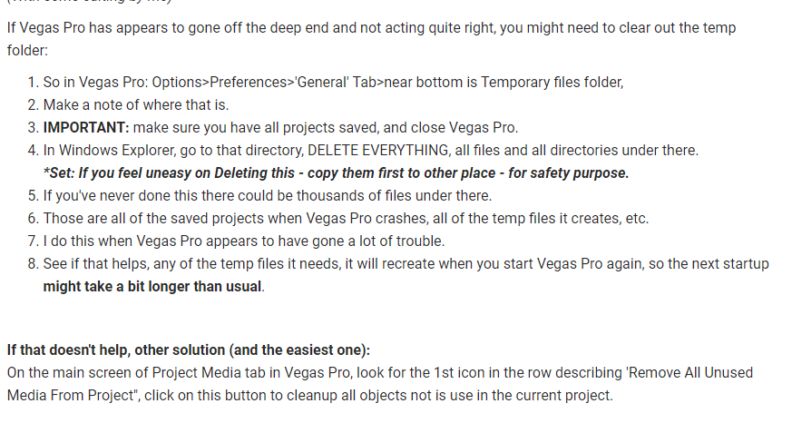

amv.tools TO-DO

===

## Vegas Pro beginners guide to editing

 - Masking
 - Effects
 - Media generators (text, solid etc.)
 - Track effects
 - Parent tracks
 - Add these to troubleshooting:

## Premiere Pro

- Turn all selected clips into subclips script

## After Effects
- mmv editing guide
- dynamic link guide
- text selectors and animators
- puppet pin
- 3D layers
- custom workspaces
- rewrite Composition a bit, add this: "the main use of compositions in AE is organization and re-use and to help with compositing as some effects and techniques are better applied on a precomp rather than on the clips directly"

## General
- Encoding guide. link to [basics](/after-effects/basics)

# AHK

### Copy Taran's AHK scripts and make ae.ahk

- Tap to send S (scale)
- Hold and move mouse to change scale
- Shift + S, script clicks on the scale property

# Essentials script

I found my old notes

### Packages to add: 

- Torrent client
  - Note about how uTorrent sucks, shows ads and mines bitcoin
  - Deluge
  - Transmission
  - qBitTorrent
- Image Editor
  - Note about photopea
  - paint.net
  - GIMP (ugh)

### General Windows things:

- Enable file extensions in explorer

### Program specific settings / plugins

The script could theoretically change stuff about installed programs if I can find the configuration files.

### After Effects:

- FXConsole
- RepositionAnchorPoint (maybe my remix version)
- Note about other good free plugins like ease and wizz

### Vegas:

- Disable resampling in default project settings
- Set the default framerate to 23.976

