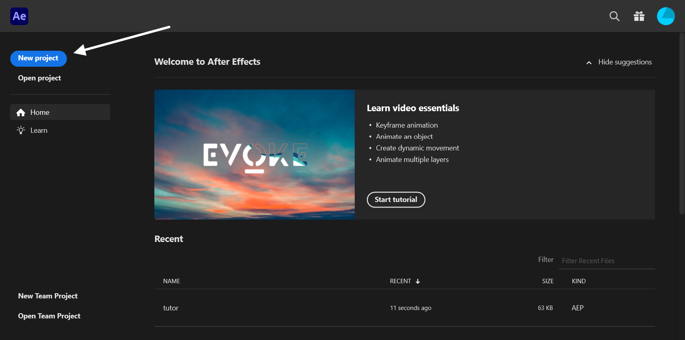
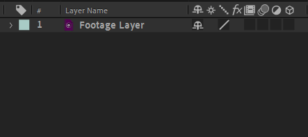
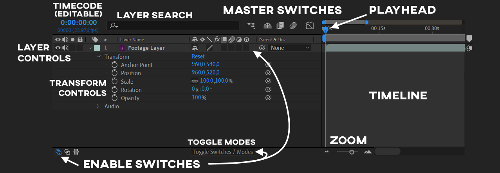
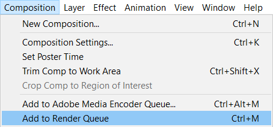

Covers the absolute basics of After Effects like the UI, some keyboard shortcuts and how to make a project.

===

## Projects and Compositions

To get started, click the New Project button or use <kbd>File > New > New Project</kbd> or <kbd>ctrl + alt + N</kbd> to create a new project. From there, create a new composition by clicking on the <kbd>New Composition</kbd> button or with the <kbd>ctrl + N</kbd> shortcut.

## Importing footage

Footage can be drag n dropped to the project panel and to the timeline. Footage can also be imported from the <kbd>File > Import</kbd> menu. After importing, add your footage into the composition by dragging it from the project panel into the timeline.

[row]

## Composition settings

Since you've already created a composition, your footage might have different dimensions than your composition. To change the composition settings you can right click the composition in your project panel or use <kbd>ctrl + K</kbd> to open composition settings. The most commonly used composition settings are annotated in the screenshot. The advanced tab contains motion blur settings which are useful when animating transitions etc.

[divider/]

[/row]

## Manipulating footage 

To cut a clip at the playhead, use <kbd>ctrl + shift + D</kbd>. <kbd>ctrl + D</kbd> on its own duplicates a clip. As you'll notice, every clip is its own layer in AE. This makes general workflows like finding and arranging clips a bit of a chore in After Effects. This is why I recommend using Premiere Pro to cut and arrange your video and only after that bringing it into AE. You can send clips (or even the whole timeline) from Premiere into AE with [TODO: Dynamic Linking](#manipulating-footage) .

## Transforming layers

[row]
After Effects has transformation controls built into the preview panel. When you have a layer selected, transformation controls should appear in your preview window. These are useful for quickly changing the position and scale of your layers.

For more accurate control (and keyframing) you will want to use the transformation controls. To access these, untwirl (by clicking the small chevron [i=untwirl/] next to the layer name) the layer and then untwirl the transform section that will appear.

### Transform shortcuts

You can use keyboard shortcuts to access individual transformation properties. (Tip: by holding shift after the first one, you can reveal multiple properties with shortcuts)

Transform property shortcuts: [kbd=S/]cale , [kbd=P/]osition , [kbd=R/]otation , [kbd=A/]nchor Point , Opacity ([kbd=T/]ransparency) 

You can also use the <kbd>right click > transform</kbd> menu on the layer to access useful shortcuts for common transform operations like flipping, fitting and resetting. Most properties in AE have a [kbd="right click > reset"/] option.
[divider/]

{.nomobile}
[/row]

## Layer Controls

Each layer has it's own controls on the left of the timeline. If yours look different, you might have toggled Modes / Switches. To toggle this back to "normal" you can hit <kbd>F4</kbd> or the button at the bottom of the timeline that says <kbd>Toggle Switches / Modes</kbd>. If you have more than what's shown in the screenshot, you can either leave them there or right click Modes and hide it. If you don't see Switches or Modes, activate switches from the bottom left button.

## Layer Controls Legend

<icons></icons>

|                   Icon                   | Name                         | Explanation                                                                                     |
| :--------------------------------------: | ---------------------------- | ----------------------------------------------------------------------------------------------- |
|                | Eye (Visibility)             | Controls the visiblity of the layer                                                             |
|        | Speaker (Mute)               | Mutes the layer                                                                                 |
|              | Solo                         | Only layers with this switch enabled are rendered                                               |
|              | Lock                         | Locks the layer, preventing edits to any of its properties                                      |
|                | Tag                          | The color tag of the layer                                                                      |
|            | Index                        | The number of the layer                                                                         |
|                | Shy                          | Shy layers are hidden from the timeline (still rendered) when the master shy switch is enabled  |
|              | Star                         | Collapses transformations for compositions and continuously rasterizes vector layers            |
|            | Alias (Quality and Sampling) | Controls the sampling method used when transforming the layer                                   |
|                  | Fx (Effects)                 | Bypasses / disables effects on the layer                                                        |
|            | Frame Blending               | Changes the frame interpolation method used when the layer is time remapped                     |
|     | Motion Blur                  | Enables motion blur (only if the master motion blur switch is also enabled)                     |
|  | Adjustment Layer             | Makes the layer an adjustment layer (makes it not render and apply its effects to layers below) |
|                  | 3D Layer                     | Makes the layer a 3D layer                                                                      |

## Rendering

[row]

To render, use either <kbd>Composition > Add to Render Queue</kbd> to render with After Effects or <kbd>Composition > Add to Adobe Media Encoder Queue</kbd> to send your composition to Adobe Media Encoder. After Effects can't render in .mp4 or h264 natively. It's recommended to render with a lossless codec (like [utvideo](https://www.videohelp.com/software/Ut-Video-Codec-Suite)) in an .avi container and re-encode it to h264 for distribution. The alternatives are installing an AE [plugin](https://www.autokroma.com/AfterCodecs/After_Effects) that enables h264 / .mp4 support or using Adobe Media Encoder (AME). In my experience, AME results in worse quality and bigger files than what you can get by rendering lossless and re-encoding manually.

[divider/]

[/row]

## Tips

 - Use [kbd=L] to show the level control which controls the volume of the layer.
 - You can use [kbd=LL] to show waveforms of audio layers. You can then press [kbd="shift + L"] to hide the level control since it's mostly unnecessary.

