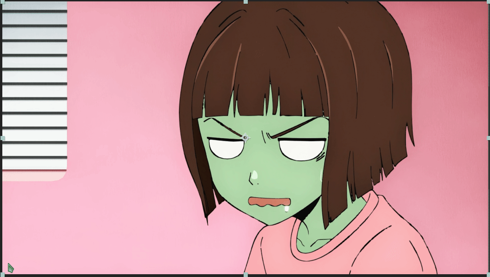
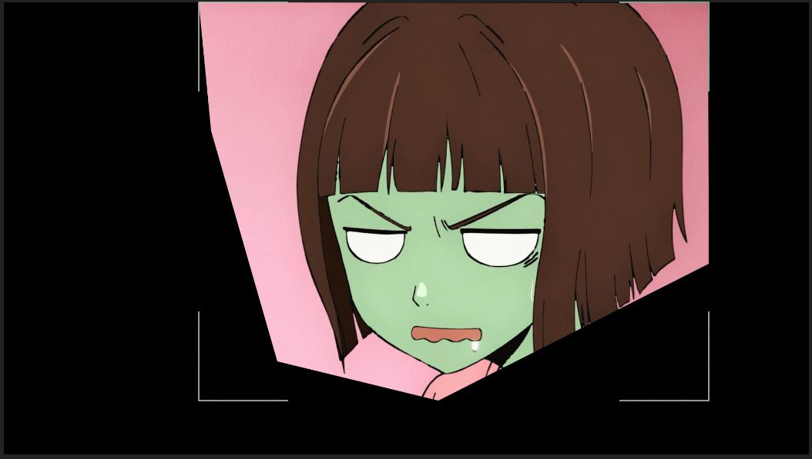

Bézier masking in After Effects, the pen tool and more.

===

After Effects has two ways of masking. The first one is the pen tool, which creates the bézier curves you're used to in other programs. The other way is RotoBrush, which is unique to AE (DaVinci Resolve also has something similar). With RotoBrush you paint over the object and the computer assisted edge detection tries to interpret what you want to keep and what it should remove. 

## Creating and animating masks

[row]

Select your layer. Press [kbd=G/] to equip the pen tool. Start clicking on the preview panel. To close your mask, click on the starting point again.

To animate the mask, enable keyframing [i=stopwatch/] on the mask path property. The mask path property can be accessed quickly by pressing <kbd>M</kbd>. To adjust the feather of your mask, press <kbd>F</kbd> to bring up the feather property or <kbd>MM</kbd> to 
bring up all the mask properties. Included in the mask properties is mask expansion which expands or retracts the mask.

While you're masking and especially when you're animating a mask, you'll want to change the mask mode to "none". This makes the mask not apply, letting you see the unaffected source. The mask mode can be changed from the dropdown menu next to the masks name. You can also invert the mask with the checkbox next to the mode.

[divider/]

[/row]

## Masking workflow and differences to Vegas Pro

{.left}

After Effects lets you create multiple, separately controlled masks. So you can mask an object from start to finish and add another mask later, without affecting the existing mask(s).

In Vegas, you can draw a mask around your subject, move to the next frame and reset the mask. This is not possible in After Effects. Resetting in AE makes the mask a square, which means you cannot make new masks for every frame. You must move the points of the previous frame to fit the next frame. You can add and [delete*](/after-effects-extra/preferences) points between keyframes.

Combined, these two differences result in a very different masking workflow in AE compared to Vegas.

Since After Effects does not let you reset the mask and draw it again every frame, like Vegas does, you want to split your subject into multiple parts. This way you can work with a manageable amount of points at a time. You also want to be smart with your points, using curves to your advantage instead of spamming points to go around a bend. This way you only have to edit one to three points (and their handles) per curve instead of having to move tens of points around.

After masking one part you just need to make sure whatever part connects to it has some overlap. This overlap doesn't have to be perfect, in fact it's usually better to generously overlap two masks than to try and match their outlines. Most of the time when you try to match two mask outlines, they result in some pixels between them being left out of the mask entirely. 

### Tips

[row]

- To easily change the mask mode while editing the mask, you can press <kbd>N</kbd> for "none", <kbd>A</kbd> for "add" and <kbd>S</kbd> for "subtract" mode. The same goes for the rest of the mask modes. Remember, this only works while you're actively editing a mask, meaning clicking and dragging a point.
- If you have multiple positive masks overlapping a negative mask and causing problems, try moving the negative mask to the very bottom of the mask list. AE renders the masks in order and having the negative masks at the bottom makes them apply last and cut every positive mask.
- When masking in parts, each part has it's own keyframes. Which means you don't have to animate masks on parts that do not move.
- After finishing a mask part, you can lock [i=lock/] it to prevent accidental edits to it.
- You can change the masks color from the color tag, on the left of the masks name.
- You can double click the shape tools like the oval to make a full screen shape mask. This can be used to make a vignette with feathering etc.

[divider/]

| Action                   | Shortcut |
| ------------------------ | -------- |
| Pen Tool                 | [kbd=G/] |
| Shape Tool               | [kbd=Q/] |
| Show all masks           | [kbd=M/] |
| Show all mask properties | [kbd=MM/]|
| Show mask feather        | [kbd=F/] |
    

[/row]

