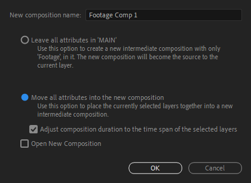

Going over compositing essentials, precompositions and project navigation.

===

<!-- Cool swag title replacement -->

com·​po·​si·​tion | \ ˌkäm-pə-ˈzi-shən \

### Definition of _composition_ {.definition}

1** : **the act or process of composing

##### _specifically_ **:** arrangement into specific proportion or relation and especially into artistic form {.subtitle}

The act of composing means combining multiple parts into a complete... composition. After Effects is a compositing program, not a traditional [NLE](https://en.wikipedia.org/wiki/Non-linear_editing). Meaning it's designed more for post-production and compositing of singular scenes rather than cutting and arranging footage. This makes little to no difference in the way people use it sometimes but make no mistake, the reason that cutting is hard to do in AE is that you're not _supposed to_ cut an entire anime season inside After Effects.

What you are supposed to do, is to cut and arrange your video in Premiere Pro, select all clips belonging to a scene and [kbd="Right click > Replace with After Effects composition"/]. This will send the clips from Premiere into After Effects and replaces the clips in Premiere with a linked AE composition. This way you're using Premiere as your main project and sending bits of it to AE for post production. You can also just send the entire project into AE and work with it that way. [That's the way I do it](/blog/how-to-clip-like-me). If you can't or don't want to use Premiere Pro, you can render your clips or project and import into AE. This won't preserve your cuts, effects, masks or layers like Dynamic Linking from Premiere does. But if that's not an issue, it works.

## Precomposing

Once you have your scene or project in AE, you may find yourself having problems with timeline space. Since every clip is a layer by necessity, they add up quickly. To make it easier on you (and possible collaborators) the clips can be grouped into compositions. The process is similar to Premiere's nesting / subsequences. To precompose layers, select them and [kbd="right click > precompose"/] or [kbd="ctrl + shift + c"/]. The precompose dialog box will show up and you'll usually want to select "Move all attributes..." and check the box for "Adjust composition duration...". Then click OK to create the precomposition. If you haven't worked with a a program with a similar feature before, compositions will appear like "mini projects" of their own, inside your main project. They have their own timeline but act like clips. You'll get used to it.

## Navigation

You can double click a composition to open it. To get back out you can click on the tabs on the top left of the timeline that show all open compositions. There's also a "mini-map" that can be accessed by pressing [kbd="tab"/]. The keyboard shortcut [kbd="shift + esc"/] toggles between the two most recently opened comps. To make your navigation and general life experience better, you should label the compositions you make. And all layers in your project. And all items in your project panel (and all files on your computer). To give an item a name in AE, select it and press [kbd="enter"/].

## Tips

* Since comps are layers, you can mask them, use layer styles and effects on them and do anything you can with a normal layer. You can even precompose your already precomposed compositions!
* Precomposing solves many problems with organizing and applying effects. If an effect is acting up, try precomposing your layers and applying the effect to the created composition.
* If you want to reuse a layer or layers multiple times, precomping first and reusing that composition will make AE perform better. After Effects knows that it's the same composition, and it reuses the prerender of it for all of the instances of that composition.

[assets=inlineCss]
.composition #summary {
	display: none;
}
.composition .definition {
	margin: -2rem 0;
}
.composition .space {
	margin-left: 1rem;
}
.composition .subtitle {
	margin-left: 4.25rem;
    font-size: 1rem;
    font-weight: 400;
    margin-top: -1.9rem;
    color: var(--color);
}
.composition .fancy-title-container {
	margin-bottom: 4rem;
}
@media only screen and (max-width: 780px) {
    .composition .definition {
    	font-size: 1.5rem;
		margin: -1.75rem 0;
    }
    .composition .subtitle {
        font-size: 0.8rem;
    }
}
[/assets]

