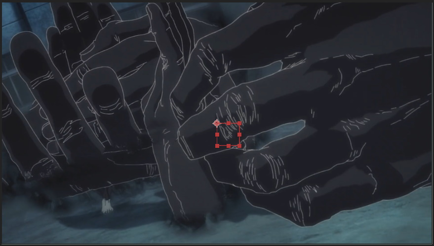
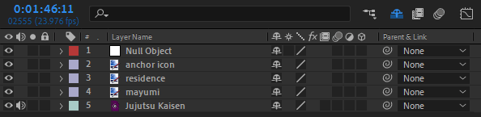

Transform options beyond position, scale and opacity.

===

## Anchor points

The anchor point is where all layer transformations originate. Most layers have the anchor point at their center by default. You can move the anchor point [i="anchor"/] in the preview panel with the [kbd=Y/] Pan Behind tool or with the transformation controls revealed with [kbd=A/]. The transformation controls do not automatically apply the anchor point offset to the [kbd=P/]osition property, so the layer will move. The pan behind tool moves the layer and anchor point the same amount, keeping the layer where it is. After you change the anchor point location, try changing the [kbd=S/]cale or [kbd=R/]otation to see exactly how the anchor point works.

## Null layers

Null layers or null objects are layers that exist. And that's all they do. Null layers do not render anything, they're mostly used as [expression](/ae/expressions) controllers or parents. So when you need a layer but don't want it to affect anything in your composition. You can create a null with [kbd="ctrl + alt + shift + Y"/] or from the application menu [kbd="Layer > New > Null Object"/]

## Parenting

Parenting is a way to hierarchically control layers. All transforms of the parent layer apply to of its child layers. Parenting is often used to "attach" layers to others and to transform multiple layers in a uniform way.

To parent a layer, select it and drag the layer pickwhip [i=pickwhip/] icon to the parent layer. A parent layer can have multiple children but a layer can only have one parent. Parent layers can be the child of another layer.

Parents act as the anchor point of the entire parent - children group. If you rotate the parent, all of it's children will rotate around it, the same way they would if their anchor point was at the parents location. Child layers still have their own transformations, anchor point included, which can be used to position the child layers relative to the parent (or inside the group, if that makes more sense).
