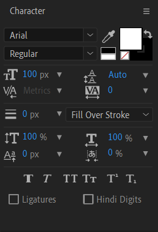
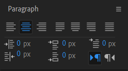

To create a text layer, you can use either the text tool [kbd="ctrl + T"/] or the new layer menu [kbd="ctrl + alt + shift + T"/]. The layer menu creates a centered point text layer while the text tool lets you create a paragraph text box in any location. The difference between point and paragraph text is that paragraph text wraps the text inside the text box automatically. Point text doesn't wrap at all, which can be useful when working with [text animators](/ae/text/animators) and path text. You can convert point text to paragraph text and vice versa by right clicking the text layer in the preview panel while not editing the text.

===

## Text panels

[row]

The character and paragraph panels are special panels that control your selected text layers. The character panel controls how the characters look and the paragraph panel controls the layout of the paragraphs. By default they're found on the right sidebar.

The important thing to know and remember about the text panels is that they never reset. So whatever you were doing the last time you worked with text will be the default settings for new text layers. Also, the text panels only affect text layers you've selected and if you're in text edit mode, they only affect the specific characters you've highlighted. If you're in text editing mode and haven't selected any text, the text panels will not have any effect. 

[divider]
{.panel}
[divider]
{.nomobile .panel}
[/row]

### Tips

* Double click a text layer to edit the source text. Useful if you fail to type in anything on creation or if there's a lot of transformations etc. on the layer.
* To easily select the text layer without entering text editing mode, deselect all layers and click on the text layer on the timeline instead of clicking on it from the preview panel. This allows you to easily access the non-editing mode right click options.
* Hit the shortcut [kbd="ctrl + T"/] again when the text tool [i=text/] is selected to toggle the vertical type tool [i=vtext/] which creates vertical text. 
* You can open multiple stacked panels by holding alt and clicking on a closed panel. This toggles "multi panel mode" on / off. When it's "on", you have to click on each panel separately to open and close it. When it's "off", whichever panel you click on will be the only one that's opened and the others are closed automatically. Everything is in quotes because this is not a real thing it just helps to think about the behavior of stacked panel groups like this.

