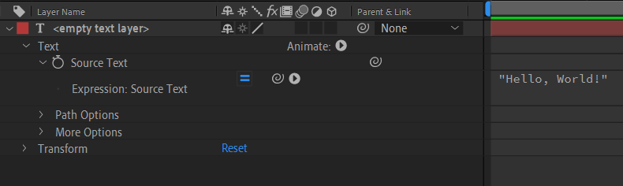

Expressions are pieces of code that calculate the value for a property. To apply a property, [kbd="alt click"/] the [i=stopwatch/] and a text field will appear. 

===

## Your first expression

[row]

Hit [kbd="ctrl + shift + alt + T"/] to create an empty text layer. 

[i=untwirl/] Untwirl it and find the [kbd="Text > Source Text"/] property. 

Alt-click on the [i=stopwatch/] and type in `"Hello, World!"`, with the quotes. 

Then click outside of the expression field. You've now created your first expression in After Effects.

[divider]
{.panel}
[/row]

You might be asking, why would anybody type in their text into this expression field thingy??? And you'd be right. It's not very useful as is. 

===

## A more practical example (typewriter effect)

{.panel}

Make a new composition and a new text layer. This time you need to type something in the text layer. To make a basic typewriter we're going to use the expression `value` and a function called substring. You can first try `value` on it's own. It's very exiting, it returns the value of the property *before* the expression. So on it's own it does nothing.

The other expression we need is `time`. Try replacing `value` with `time`. It will display the current time, in seconds, not frames. `time` is often used as a placeholder value in animations. Now, lets combine both of these. `value.substring(time)` will produce sort of what we're looking for, but the letters are dissapearing instead of appearing and it's incredibly slow (your composition needs to be several seconds long to see it working).

To fix this you could spend some time on [Mozilla's JavaScript substring documentation](https://developer.mozilla.org/en-US/docs/Web/JavaScript/Reference/Global_Objects/String/substring) but I'll just tell you what's wrong with it. First, we need to give it a start point and use our `time` as the end value. `value.substring(0, time)` will make it go in the right direction. Then you can multiply `time` with any number to make it go faster. In my example I use `.value.substring(0, time * 15)`

## Using controls

[row]

Controls are special effects that you can use to control your expressions. We'll use one to make our typewriter keyframeable. 

First, add a Slider Control effect to your text layer. (from the effects panel, expression controls category).

Then make sure you see your effects controls, click into the expression, remove `time * 15` and use the [i=pickwhip/] pickwhip to link to the slider control. You need to be in expression editing mode to insert the slider control into the expression instead of replacing it entirely.

This is what you should have after successfully linking to the slider effect:

`.value.substring(0, time * effect("Slider Control")("Slider"))`

You can now [i=stopwatch/] animate the slider to make your text appear at any speed you wish.

[divider]

[/row]