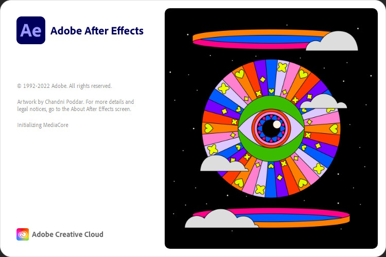

A course to help intermediate / advanced editors get started with After Effects.

===

# What is After Effects?

After Effects is a compositing program. In a normal editing program, you're arranging clips to form a video. In After Effects, you're arranging layers to form a clip. This is not to say that making entire videos solely with After Effects isn't possible. It is possible, you just have to remember that the program is built for compositing, not timeline arrangement.

# Guides in this course