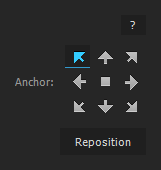
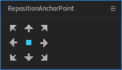

Plugins I like, use and recommend, in no particular order.

===

## FXConsole

{.right .caption .aeborder .pair}

There's a search bar in the Effects & Presets panel, but it usually has some startup lag. A free extension called [FXConsole](https://www.videocopilot.net/blog/2018/05/fx-console-updated-to-v1-0-3/) is a lot better for serial effects addicts. It's activated by pressing <kbd>ctrl + space</kbd> and it can search and apply any effect or preset. You can even replace an effects default settings with a preset (when applying it through FXConsole).

## RepositionAnchorPoint

[row]

A small script UI panel that repositions the anchor point of a layer. The original is available on [AEscripts](https://aescripts.com/repositionanchorpoint/), name your price. 

I have also made an alternate version called [RE-AP](/reap) that removes unnecessary elements like the text, [kbd="reposition"/] and [kbd="?"/] buttons and makes all of the arrows instantly reposition the anchor point. To be clear, the difference between my version and the original is that a bunch of lines have been deleted. 

[divider]
{.panel}
[divider]

[/row]

## Flow

{.right .caption}

[Flow](https://aescripts.com/flow/) ($30.00) allows you to apply curves to keyframes. No matter what type of keyframes or how many etc. It also has a very intuitive curve editor. You can save your own curves and use them across projects.

You can apply the curves to the keyframes or as expressions. The keyframe mode works most of the time. If it doesn't, or you plan to edit the keyframes a lot, the expression mode saves you having to reapply every time you move the keyframes. The downside of the expression mode is that if you try to change the curve, it complains about there being an existing expression. And that you can't use your own expressions on the property.

## Duik Ángela

[Duik](https://rxlaboratory.org/tools/duik-angela/) does a lot of mostly animation and rigging related things. But you can dock the Animation tab separately and it has some very nice easing controls. Here's a [Jake in Motion](https://youtu.be/IIBqi3K32c4?t=76) video about Duik and other tools that you might find useful. The difference between all of them and Duik is that Duik is free!

