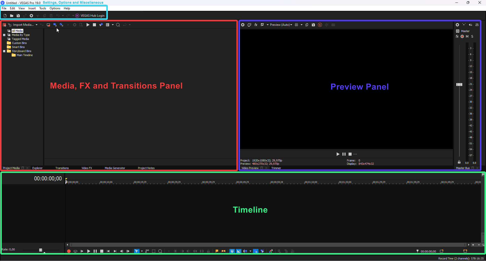
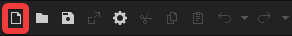
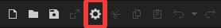
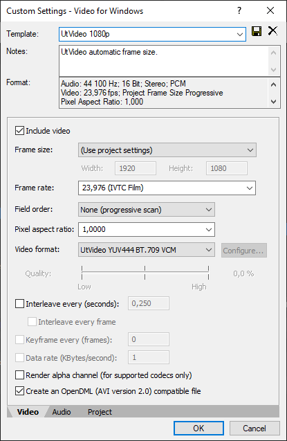
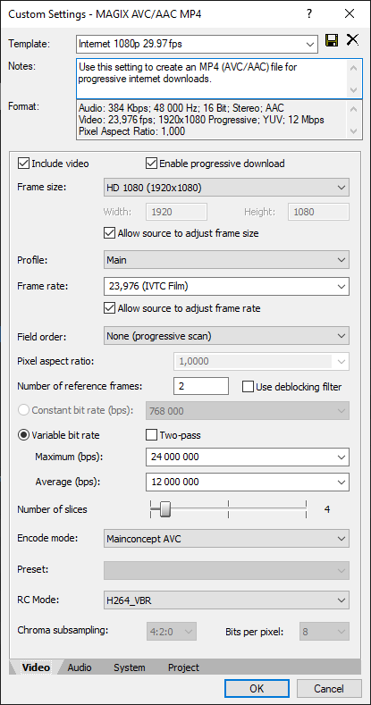

Covers the absolute basics of Vegas Pro like the UI, some keyboard shortcuts and how to make a project.

===

## Quick tour of the UI

The Vegas Pro workspace is split into panels. For transforms, effects and so on, Vegas Pro will open separate windows.

[row]

## Projects

Opening Vegas Pro will automatically create a new project, but if you want to create a new one, click the New Project button or use [kbd="ctrl + shift + N"].

To change your project settings, find the [i=vpgear] gear icon at the top left of the main window (or at the top left of the preview panel) or use [kbd="alt + enter"].

[divider]

[/row]

## Importing footage
 
Footage can be drag and dropped to the project panel and to the timeline. Footage can also be imported from the [kbd="File > Import > Media"] menu. After importing, add your footage by dragging it from the project panel onto the timeline.

## Manipulating footage

You can do basic manipulation like fades and cuts directly on the timeline. Moving clips on top of each other (on the same track) will automatically crossfade between them. Use [kbd=S] to split clips. For more options you can right click the event (clip) you want to manipulate.

### Basic keyboard shortcuts 

| Action                   | Shortcut               |
| ------------------------ | ---------------------- |
| Split                    | <kbd>S</kbd>           |
| Delete                   | <kbd>Delete</kbd>      |
| Copy                     | <kbd>Ctrl + C</kbd>    |
| Paste                    | <kbd>Ctrl + V</kbd>    |
| Cut                      | <kbd>Ctrl + X</kbd>    |
| Group selected events    | <kbd>G</kbd>           |
| Un-group selected events | <kbd>U</kbd>           |

## Rendering

The render menu is found at [kbd="File > Render As..."]

For your video to look the best, it's recommended to render a lossless master file, then encode that to other formats later. You can also render directly in a lossy format like h264 / mp4 but then you'll be relying on Vegas' encoder. As long as you don't remove your project files both ways work. Note that whatever the settings, whatever the editing software, render settings cannot make the quality of your source better.

!! Always disable [resampling](/vegas-pro/totaveotk)! You can disable resampling in your project settings. In older versions it must be disabled on a clip by clip basis. [Learn more about resampling](https://amv.tools/vegas-pro/totaveotk)

### Render settings

Vegas Pro can render a variety of file formats and codecs. Most used formats for AMVs and hobbyist video in general are `mp4` and `avi`, which Vegas Pro handles natively. Simply put, avi is a lossless format, which means it loses no quality when rendered and mp4 is a lossy format, which means that some quality is lost when rendered. Lossless video can exceed 4GB for a three minute video, while lossy formats like mp4 are much lighter, usually weighing in at 50 to 500 MB for a three minute video.

It's recommended to render a lossless version with the [UtVideo codec](https://github.com/umezawatakeshi/utvideo/releases), which you can install from their page, with the [essentials script](https://amv.tools/resources/essentials) or as a part of amv101's [AMVpack](https://www.amv101.com/software/amvpack). AMVpack and the essentials script also come with AMVtool which you can use to encode the lossless file into a lossy mp4 (h264) file for uploading.

### Render templates

Vegas Pro comes with a ton of render templates. You should set up some custom ones for rendering as the default ones usually use the wrong frame rate or do not use the UtVideo codec. You can save templates by editing an existing one, changing the name and clicking the save icon at the top of the template window. There are example render templates at the bottom of this page.

!!!! Most anime have a frame rate of 23.976. You can check what frame rate your source is in from its properties, accessed by right clicking it in the project media panel.

#### Rendering lossless video (AVI / UtVideo)

To render lossless avi, pick any template from the Video for Windows category and modify it to fit your sources frame size and frame rate. Change the codec to UtVideo (most of them are fine).

#### Rendering lossy video (MP4 / h264)

If you wish to render mp4 / h264 directly, use the Internet HD 1080p 29.97 template in the MAGIX AVC/AAC MP4 - category. If a template does not allow you to change the framerate to 23.976, try using another template.

## Example render templates

[row]

[divider]

[divider]

[/row]

