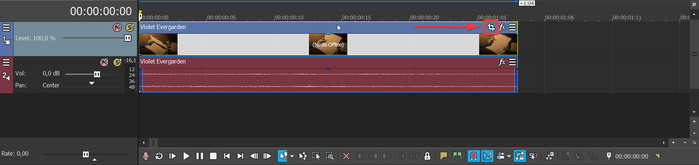
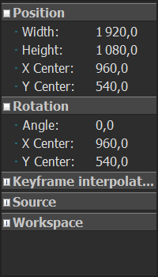
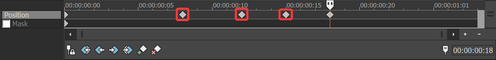

Transforms (_i.e._ zooming in, cropping, rotating...) in Vegas Pro.

===

## The Pan/Crop Menu

The Pan/Crop Menu can be found on the bottom right corner of all clips. In older versions of Vegas Pro it's at the top right. If you don't see the clip menu, zoom in.

The Pan/Crop menu lets you transform your clip. The project preview will update as you make changes. Notice that you can move the playhead while the Pan/Crop window is open, so the preview might not show the same frame as the Pan/Crop menu. If you want to sync the preview and the Pan/Crop menu, click on [i=syncCursor] at the bottom of the Pan/Crop window.

## Additional controls

[row]

The Pan/Crop window also has numerical controls available for precise adjustments.

You may also want to disable **Lock Aspect Ratio** and **Size About Center** for freer controls. You can also hold [kbd=ctrl] and / or [kbd=alt] to momentarily unlock the aspect ratio and size from center.

[divider/]

[divider]

[/row]

## Animating

The Pan/Crop menu allows you to animate the transform. Vegas will automatically insert keyframes and interpolate between them when you make changes. If you want to stop the interpolation (animation between keyframes) right click and select the Hold option. This will make each keyframe hold it's value until the next keyframe. To disable animation completely, remove all but one keyframe. Vegas will not let you remove all keyframes.

Here's an example of how animating a transform looks in Vegas Pro:

[row]

[divider]

[/row]