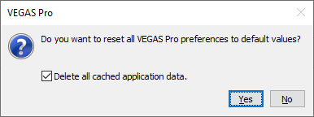

Common troubleshooting steps for Vegas Pro. Some settings mentioned are not available in all versions.

===

## Checklist

[div class="checklist"]
- Restart Vegas.
- Check project and source framerates are the same
- Check for stacked keyframes
	- Sometimes two (or more) keyframes can occupy the same frame "on top of each other". Try moving the keyframes around the problem frames to see if there's multiple keyframes on a single frame. 
	- Try cutting the clip at the problem frame, this should force the keyframes to separate.
- Restart your computer.
- If your issue is playback related, check how much RAM you're allowing Vegas to use in the video tab of preferences.
	- Also make sure your GPU is selected in the "GPU acceleration" dropdown menu.
- Hold `ctrl` and `shift` while starting Vegas until the "reset all Vegas Pro preferences" dialog pops up. If the normal Vegas splash screen loads, try again. Select "clear cached data" from the dialog and click Yes
  - If you can't get the dialog to show up, try opening Vegas directly from it's executable at `C:\Program Files\VEGAS\VEGAS Pro <version>\vegas<version>0.exe` while holding `ctrl` and `shift`.

- Try disabling / enabling GPU acceleration of video processing in the video preferences
- Try disabling / enabling OpenCL/GL in the internal settings
- Try disabling / enabling the So4 compound reader in the internal settings
- Enabling legacy AVC and HEVC decoding in the `File I/O` tab in preferences can stop Vegas from crashing but simultaneously makes you unable to use 10bit videos.
- ???
- Profit
[/div]

### Accessing Vegas Pro preferences

The Vegas Pro application preferences are located in the `Options` menu.

### Accessing Vegas Pro internal settings

To access the internal settings, hold shift and click on the `Options` application menu and select `Internal`. If there's no `Internal` option, continue to hold shift and select `Preferences`. If you held shift while opening preferences there should be a tab called Interal.
    - Most internal settings require a restart after they're changed. 
    - There's a search bar in internal settings.