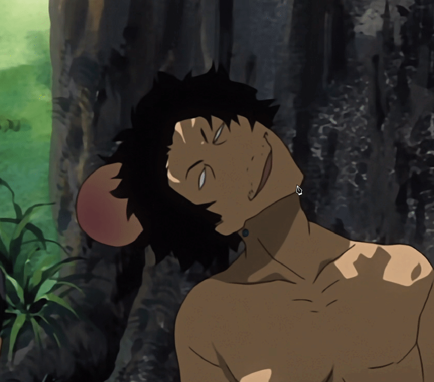
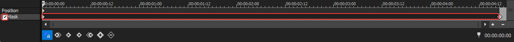

Bézier masking in Vegas Pro, the anchor creation tool and more.

===

Masking in Vegas Pro is done using the Anchor Creation Tool, which creates the bézier curves you're used to in other programs. Masking can be done in the Pan/Crop menu or using the Bézier Masking FX. The latter is more useful for motion tracking.

## Creating and animating masks

Select the event that you wish to mask on its track and go to the [Pan/Crop menu](/vegas-pro/pan-and-crop#the-pan-crop-menu). At the bottom of the Pan/Crop menu, make sure to enable the mask layer, then select it.

