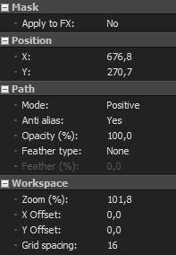

Bézier masking in Vegas Pro, the anchor creation tool and more.

===

Masking in Vegas Pro is done using the Anchor Creation Tool, which creates the bézier curves you're used to in other programs. Masking can be done in the Pan/Crop menu or using the Bézier Masking FX. The latter is more useful for motion tracking and will be covered in the [motion tracking guide](/vegas-pro/motion-tracking).

## Creating and animating masks 

### How to create a mask
Select the event that you wish to mask on its track and go to the [Pan/Crop menu](/vegas-pro/pan-and-crop#the-pan-crop-menu). At the bottom of the Pan/Crop menu, make sure to enable the mask layer, then select it.

[row]

Select the Anchor Creation Tool [i=vppen/] on the left of the menu and proceed to mask. To see your mask on the preview, make sure to press [i=syncCursor/]. 

You can remove one of your anchoir points by using the Anchor Deletion Tool and clicking on it.

You can also drag any of your anchoir point to another location, select the Normal Edit Tool and drag it to where you want.

You can also give it some angle (I couldn't find a way to phrase this) by dragging the anchor point with the Anchor Creation Tool.

Finally, when your masking is done, you can play around with the settings on the left, to make it look better, or change the masking mode to negative...

[divider/]

[/row]

The mask can be as precise as you want depending on how many points you make.
### How to animate your mask
