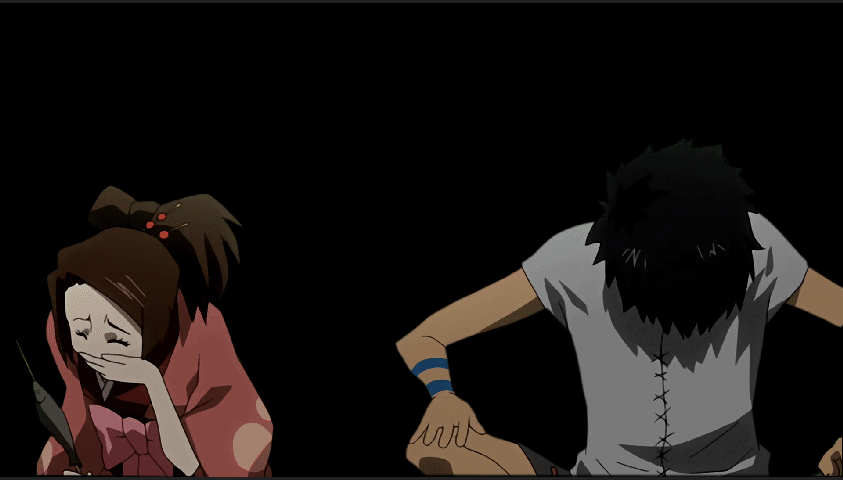

Bézier masking in Vegas Pro, the anchor creation tool and more.

===

Masking in Vegas Pro is done in the Pan/Crop window. Masking can also be done using the Bézier Masking effect, in newer Vegas versions. The masks created with the Bézier Masking effect can be used for [motion tracking](/vegas-pro/motion-tracking). The effect also allows independent control of multiple masks, something that the mask in Pan/Crop window cannot do. But the Pan/Crop window is more than enough in most cases and it allows zooming the view which is a major advantage for accuracy.

## Creating a mask

Masks come in all kinds of shapes like rectangles, ellipses and freeform bézier curves. The regular shapes have their own tools in the Pan/Crop windows left toolbar. Using the Anchor Creation tool, you can create freeform bézier curves. Bézier is a type of curve, mathematically speaking. They're created by defining points (called anchors). Each anchor also has two "weights" which define how much the line to the previous point and next point should curve. Since each anchor has these weights, the resulting curve is a product of both of its anchors weights. The mathematical weights are represented by "handles" in almost all programs that use bézier curves.

To create a mask, select the event that you wish to mask and open the [Pan/Crop menu](/vegas-pro/pan-and-crop#the-pan-crop-menu). At the bottom of the Pan/Crop window, make sure to enable and select the Mask option, under Position.

[row]

Select the Anchor Creation tool [i=vppen/] to add anchors. Clicking on an anchor lets you move it while clicking anywhere but an anchor will add a new anchor to your line. If you click the first anchor after creating at least two, the mask shape will be closed. It's still possible to edit the mask shape when it's closed.

To delete anchors, select them with either the selection tool or the Anchor Creation tool and press [kbd=delete]. You may also use the Anchor Deleting tool[i=vpdelete/] from the toolbar to remove anchors with a single click.

To move your view, use the Normal Edit tool [i=vpedit/] **OR** hold [kbd=ctrl] and click n drag anywhere in the masking view (except the actual lines of the mask).

To move your anchors, use the Normal Edit tool [i=vpedit/] **OR** hold [kbd=ctrl] and click n drag the anchor point.

Using the Anchor Creation tool [i=vppen/] and dragging an anchor point without holding [kbd=ctrl] will enable the weights and reveal the anchors "handles". By adjusting the handles you can adjust the curving of the line between your anchors.

There's a ton of ways to mask, you can be as precise as you need and use curves as much as or as little as you want to. But if you ever want to use After Effects, it's a good idea to learn how to use bézier curves.

Vegas Pro lets you make multiple masks on a clip. Animating multiple masks is tedious, especially if you add more masks after already animating another mask. The main use of additional masks on a single clip are negative masks. Try making two masks (close the first and then click outside of it to start another mask). Then change the mode of the new mask to negative and move it over the first mask to see how they interact. Negative masks are basically masks for your masks. These are useful for punching holes to masks. For example, you've masked a character but their arm, hair or clothing has a gap inside the silhouette of the character. You can use a negative mask to remove that part from your main mask. 

If you want to mask multiple objects, it's recommended (by me) to just duplicate the clip and make an entirely new mask. Unless the other object is very simple. Use your own judgement.

[divider/]

[/row]

<!--

What exactly is this supposed to mean?

!! Vegas Pro does not allow you to merge or group different masks together. Make sure that you didn't accidentally start a new mask before finishing the one you initiated.

-->

## Animating masks

Enabling the mask automatically enables [animating](https://amv.tools/vegas-pro/pan-and-crop#animating) the mask. This works the same way animating the position works.

There's multiple methods to animate a mask. After masking the first frame, you can either move the points of your existing mask to their new locations, or [kbd="right click > reset mask] to start with a clean slate. This resetting functionality is unique to Vegas Pro, and doesn't work in, for example, After Effects. Which is why you should learn to use the least amount of anchors possible and how to efficiently use the curves part of bézier curves. That is, if you ever plan to use After Effects. If not, go wild and use any number of points per keyframe. It can be a very efficient and fast way of masking to reset on every frame. This is just a warning for prospective AE users to not get used to the luxury of resetting masks. 

If you're working with anime that only moves every other frame (like most anime does), you will notice that if you only make new masks on those new frames, Vegas will animate the mask between those frames. To stop this, select your keyframes and [kbd="right click > hold"]. This will turn the keyframes red and stop Vegas from interpolating (animating between keyframes).

## Mask settings

[row]

On the left of the Pan/Crop window, you'll see the different settings that you can apply to your mask:

- **Apply to FX** : when activated, this option will make it so your mask only apply to the effects of the event, not the content.
- **Mode** : **Positive** is the default, making anything inside the mask visible. **Negative** is the opposite. **Disabled** will deactivate the mask.
- **Opacity** : Reduces the masks influence on the content and other masks. A bit counter-intuitive, especially if there's only one mask on a clip.
- **Feather** : Blurs the edges of the mask. Good for blending the masked object into a new background and reducing "chatter" (or discoloration) of the edges.

[divider/]

[/row]

## Tips

 - Depending on the complexity of the object you want to mask, you may want to use multiple masks. In this example, there's a total of 4 masks, with different settings.

- It's very easy to lose track of your mask in the Pan/Crop window by zooming and / or panning around. Deselection is also very common. To continue your mask, try double-clicking on the last anchor point with the Normal Edit tool [i=vpedit/]. If nothing else works, try [kbd="Ctrl + Z"] until you see the anchor points again. Remember that either [kbd="ctrl + shift + Z"] or [kbd="ctrl + Y"] lets you re-do anything you undo. 
