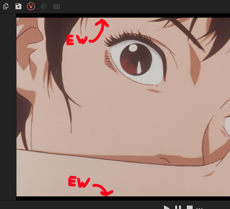
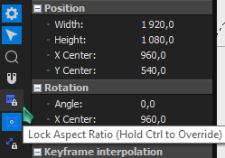
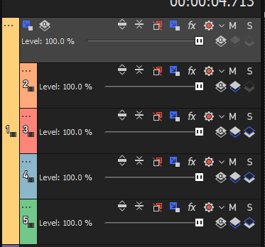

So your source in VEGAS has built-in black bars…

===

It's recommended to set up the track zoom at the start of a new project but it can be applied after you've already started editing.

## Find your sources dimensions without the black bars

[row]

Open the pan/crop window and note the current width of the source. Snip out your black bars by scaling the box vertically. Take note of the new height dimension.

If your pan crop doesn't let you only change one dimension at a time, click the "lock aspect ratio" button on the left side of the pan/crop window.

Once you have both dimensions (new height, unmodified width) noted, right click and reset the pan/crop.

[divider]

[/row]

## Composite your tracks under a parent 

[row]

In Vegas 19, the "Make compositing parent" and "Make compositing child" buttons are hidden by default. You need to edit the visible button set from the three dots track menu and make them visible.

[divider]

[/row]

Once all of your tracks are under one parent, it’ll look like this:

## Change the project dimensions

Open the project settings from the [i=vpgear] gear icon on the top left of the preview panel. Set the project height to the height of your source without black bars. The width should remain as is.

## Zoom in the parent track

[row]

Using parent motion on the parent track you can zoom in all of the child tracks simultaneously. Set the height and width of the parent motion box to the noted unmodified width of your source.

[divider]

[/row]

## Finished

That's it. Your source should now be zoomed in, chopping off the black bars. When you render with a template that has "Allow source to adjust frame size", it should adapt automatically to the new dimensions. But keep the noted dimensions around, you might need to manually set the render templates dimensions to match.

You can make new tracks in the project, just remember to make them children of the parent track.

If the clip you used to get the dimensions is messed up, remember to reset it's pan/crop.

## Credits

Original guide written by guest author [Violet Skies](https://www.youtube.com/channel/UCz9jveeG1KhbCfjQF20wzYg)