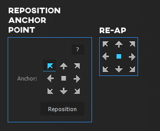

RE-AP is a custom version of RepositionAnchorPoint that minifies the UI and gets rid of an unnecessary click.

===

## Installation

- Download [REAP.zip](REAP.zip)
- Close After Effects
- Copy `RepositionAnchorPoint.jsx` from the .zip to `C:\Program Files\Adobe\Adobe After Effects 2022\Support Files\Scripts\ScriptUI Panels`
- Open After Effects
- Activate the panel from [kbd="Window > RepositionAnchorPoint.jsx"/]. 
- Dock the panel where you want it. I usually dock it next to the Align panel.
- Optional: buy the original on [aescripts.com](https://aescripts.com/repositionanchorpoint/) (it's pay what you want)

## Usage

Select a single or multiple layers. Click on any arrow or the middle square in RE-AP. The anchor point will be repositioned while keeping the position the same. Unfortunately any existing anchor point and position animations will not be adjusted accordingly. Sometimes you can fix things by repositioning multiple times on all of the keyframes. But it's best to reposition before starting to animate the layer.
