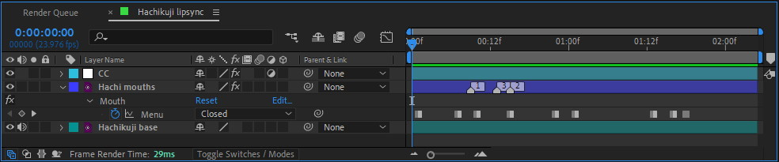

A script that creates an animatable slider controller for freeze frames. Useful for controlling mouth shapes without creating a stack of layers and manually cutting them.

===

## Installation

- Download [Lipsync Rig.zip](Lipsync%20Rig.zip)
- Close After Effects
- Copy `Lipsync Rig.jsx` from the .zip to `C:\Program Files\Adobe\Adobe After Effects 2022\Support Files\Scripts`

## Usage

Duplicate the layer, mask out the mouth and run the script. The script will create two control effects, a checkbox called "Edit mode", a dropdown called "Mouth" and place three markers onto the clip. 

Next, find where the different mouth shapes are and move the markers to those frames. 1 is closed, 2 is half open and 3 is fully open. After finding the mouth shapes and moving the markers, disable the Edit mode checkbox from effects controls. Now you can use the dropdown to select which mouth to display. Remember to [i=stopwatch/] enable animation on the dropdown before starting to lipsync.

## Tips

- After using the script once, [kbd="ctrl + shift + D"/] will run it (the most recent script) again.
- The rig can be used for other stuff than lipsyncing too, it's basically just a way to mark frames for a dropdown menu
- You can add more options to the dropdown menu effect from the small blue text that says "Edit"
	- You also need to add correspondingly numbered markers if you add more options than the default three

