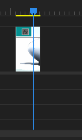

An Editor to English dictionary.

===

## AMV Term Glossary

Demystifying the lexicon

## A

#### AMV

acronym for Anime Music Video. An umbrella term used for most fan videos.

Includes:

- GMV Game Music Video
- MMV Manga Music Video
- AMV Animation Music Video
- Live Action (movies, tv etc.) fan videos
- Fancams (disputed)

#### Aspect Ratio

A number or set of numbers that expresses the ratio of the width and height of a video. Usually written in the form of WIDTH:HEIGHT eg. 16:9 (read 16 by 9). The less common form to write aspect ratios is the decimal result of the ratio eg. 1920/1080 = 16/9 = 1.777...

[aspect ratio on wikipedia](https://en.wikipedia.org/wiki/Display_aspect_ratio)

## B

#### Beta

A render of a work in progress video, usually meant to be evaluated by other editors or viewers.

## C

#### CC / Color Correction

Process of correcting the colors of a scene. Color correcting is used to account for differences in scene lighting, time of day, different cameras etc. some of which do not play a part when using certain sources.

Color Correction as a term is often conflated with [color grading](#color-grading).

#### Color Grading

[Color Grading on wikipedia](https://en.wikipedia.org/wiki/Color_grading).

Grading is the creative part of working with color, making a "look" for your scenes, conveying emotion or symbolism. Most of the time all sources have some level of grading already applied which can be hard to deal with. The process of dealing with a scenes color grading and color differences in general is called [color correction](#color-correction)

#### Cut

#### Crossfade

## D

#### Dissolve

## E

#### Easing

Easing means manipulating the speed of a keyframe animation or the weight of keyframes in the animation. See [https://easings.net/](https://easings.net/) or the video below for examples.

{.caption .third}

#### Export

Exporting means [rendering](#render) your project into a video and saving it into a file. Sometimes used interchangebly with [render](#render)

## F

#### Flow

The progression of clips throughout the amv - hard to categorize but pleasing when done well

#### Full HD

Currently the most common [resolution](#resolution), 1920x1080 or 1080p

## G

## H

## I

#### IC

acronym, see [Iron Chef](#iron-chef)

#### Iron Chef

a timed editing contest or event. Commonly timed in hours or days.

## J

## K

#### Keyframe

Keyframe refers to a value that's assigned a time in an animation. Usually indicated with a small diamond shape. When an animation has two or more keyframes, each frames value is calculated depending on how close to each keyframe it is. Some programs let you change the weight or influence of each keyframe, effectively changing the speed of the animation from one keyframe to another. This animation speed manipulation is called [easing](#easing).

#### Keying

Process of isolating certain pixel values, like color or brightness, and turning that into transparency. An example of keying is chroma keying or "greenscreening" which is keying by a color, turning the selected color into transparent pixels.

## L

#### Light leaks

## M

#### Masking

#### Match cut

#### MEP

acronym, see [Multi Editor Project](#multi-editor-project)

#### Multi Editor Project

an [AMV](#amv) made by multiple editors. Usually MEPs are run by a single editor who splits the song into sections. Then each participating editor edits their part separately and the parts are combined to make the finished video.

## N

#### NLE

acronym, see [Non-Linear Editing](#non-linear-editing)

#### Non-Linear Editing

[Non-Linear Editing on wikipedia](https://en.wikipedia.org/wiki/Non-linear_editing)

## O

#### Opacity

The visibility of the video. The higher the opacity, the more visible the video is, so it's the reverse of transparency. Sometimes used interchangeably with [transparency](#transparency)

## P

[row]

#### Playhead

The playhead is the marker and line that marks which frame is currently being viewed. See image on the right (or below on mobile)

[divider]

[/row]

#### Plug-in

Plug-in is a general term referring to any effect or panel that's not native to the editing program.

#### Pre-render

Pre-rendering is a way to reduce playback lag when previewing. Pre-render usually refers to saving a pre-render file and using that as the preview. See [RAM-preview](#ram-preview)

#### Preview

Previewing means playing your video in your editing program. Sometimes refers to the preview panel which is the section in your program that shows the preview.

## Q

## R

#### RAM-preview

RAM-preview is a way of [pre-rendering](#pre-render) without saving the render to a file. The name comes from saving the preview to [RAM](https://en.wikipedia.org/wiki/Random-access_memory) instead of a file.

#### Render

Rendering is the process of turning the source footage and your edits (aka your timeline) into a new video. Sometimes used interchangeably with [export](#export)

#### Resolution

The dimensions of a video or a project in pixels. Usually displayed in the form WIDTHxHEIGHT, eg. 1920x1080. Due to the prevalence of the 16:9 [aspect ratio](#aspect-ratio), shorthands like [1080p](#full-hd) usually refer to 1920x1080.

## S

#### Source

General term for editing materials that doesn't discriminate between the different types of [AMV's](#amv). A source can be the anime, movie or even the instagram post you use in your edit.

#### Sync

Short for synchronization. Sync is when elements of your edit (like a motion of the character and a beat in your music) happen at the same time. There are different types of sync which include but are not limited to:

- Beat sync
- Literal sync
- Lyric sync
- Microsync

See related: [flow](#flow)

## T

#### Transformation

Transformations include scale, rotation, opacity, skew etc.

#### Transparency

The visibility of the video. The higher the transparency, the less visible the video is, so it's the reverse of opacity. Sometimes used interchangeably with [opacity](#opacity)

## U

## V

## W

## X

## Y

## Z
