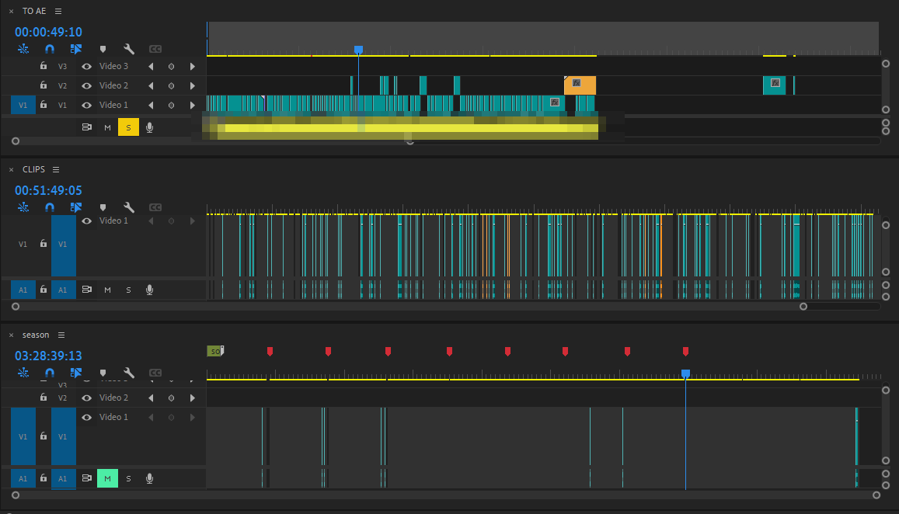

This is my personal editing process, it's not recommended or advisable.

===

That's a lie. Of course I recommend it it's how I do things and how I do things is always right.

So I start by importing the footage and making a sequence for it, separate from the song / main sequence. 

Then using Premiere Pro's [scene edit detection](https://helpx.adobe.com/premiere-pro/using/scene-edit-detection.html) feature I split the episodes into scenes. Sometimes the detection goes a bit wild, especially with shaky anime scenes and makes too many cuts. But that's an easy enough thing to fix manually.

I usually have a separate sequence for the scene detected source, clips and the main sequence. At this stage I pick scenes that I like or think I could use and drag them from the scene detect sequence to the clips sequence. Premiere automatically copies clips when dragging them into another sequence. This is handy in the next step.

Once I've processed and selected all the clips I like from all the episodes, I close the first sequence and open the main one with the song. Then I just drag clips on top of the song until it's filled. And once the song is filled, I send the entire timeline into After Effects for finishing touches.

Of course I don't stick to these steps rigorously, usually I start filling out the song way before I've processed all the episodes.

After I'm done with the video, I add all the clips I've harvested to my main CLIPS.prproj file and sort them all according to source and / or character. This way you slowly build a bit of a library you can use for future projects.

Each step of this process is like a filter where you sort out the mediocre clips.

And because it's in stages, you can work on your main comp without worrying about deleting clips accidentally. They're all still in the middle sequence, hopefully somewhat organized so you can find them later.

This post was inspired by kliksphilip's [h0w 2 x l1ke m3](https://www.youtube.com/watch?v=Sgl_bWvr5z4) series