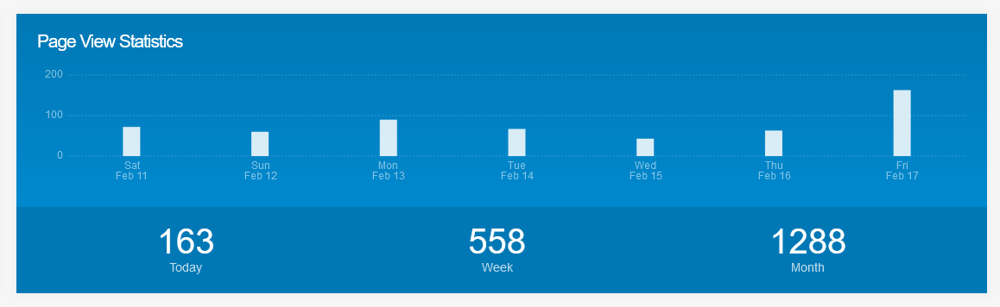

Privacy and data collected by amv.tools

===

amv.tools is built with [Grav](https://getgrav.org/) and [nginx](https://www.nginx.com/). Grav automatically logs page views when pages are loaded. This is completely anonymous. Nginx logs your IP address and your User-Agent (browser type).

In addition to basic page access logging, amv.tools uses [GoatCounter](https://www.goatcounter.com/), hosted on the same server as the main site. No third parties have access to the data collected. GoatCounter tracks page views per page, letting us see which pages are most popular and which pages are shared most often. GoatCounter also lets us ignore our own page views when testing, which the basic access counter Grav has doesn't do. That's why the previous screenshot shows inflated views on the latest day.

GoatCounter does not use any cross-site tracking cookies, which is why you do not see a GDPR / Cookie consent notice on amv.tools. We do not track you, we just count page views accurately. The closest thing to "personal data" amv.tools collects is your IP address, which every website collects, or the internet wouldn't work at all.